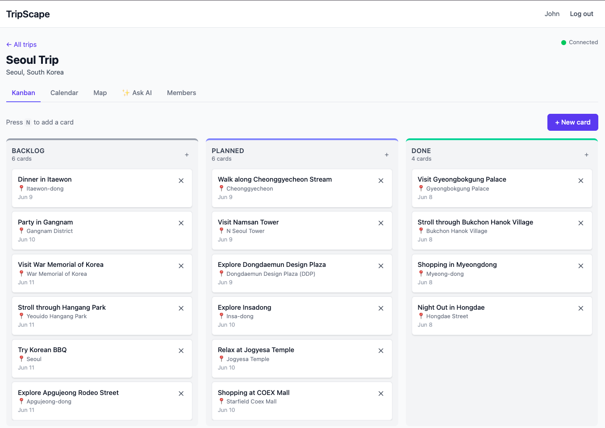
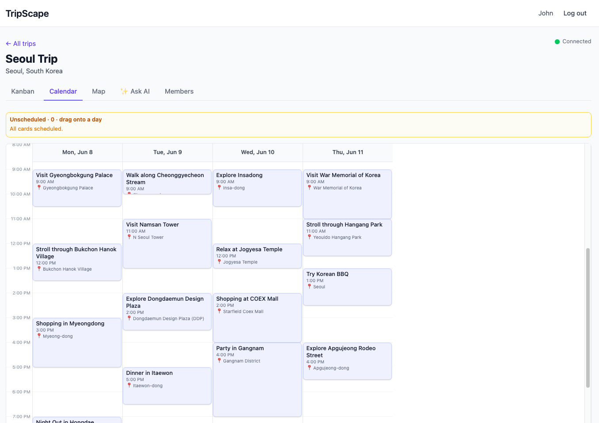
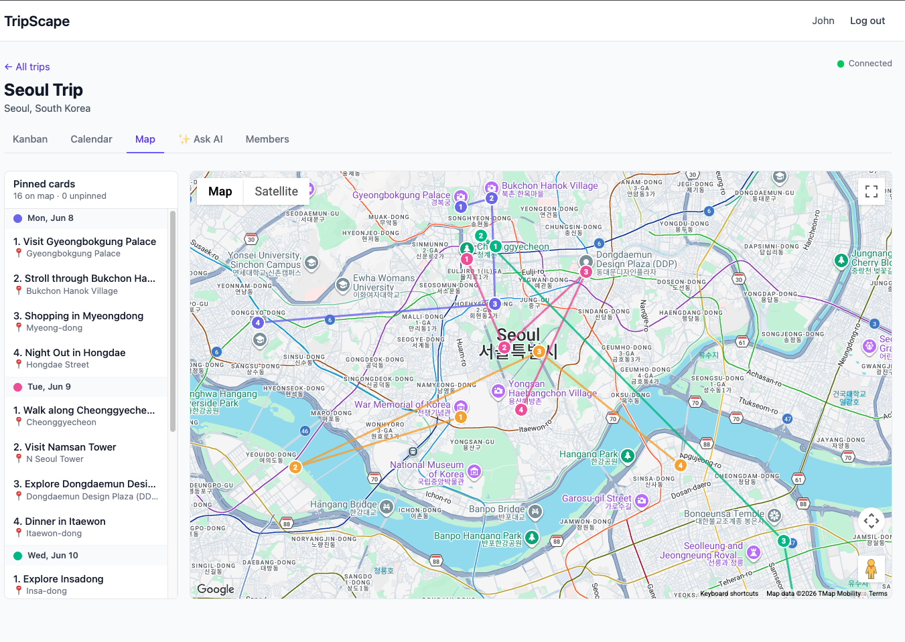

# TripScape

**Collaborative trip planning that feels live.**

A time-grid calendar, a nested Kanban board, and a Google Maps view of one trip — with WebSocket-driven realtime, an AI planner that schedules itself, and a strict 4-layer async backend.

---

## The problem

Planning a trip with other people usually means juggling three disconnected tools: a notes app for the to-do list, a calendar for the schedule, and a maps app for the places. Nothing stays in sync, and "collaboration" means screenshotting and pasting into a group chat.

## What TripScape does

TripScape models a trip as a single tree of **cards** (activities, sub-tasks, places) and renders that one source of truth through three synchronized lenses:

1. **One trip, three views.** A nested Kanban board, a week-style **time-grid calendar** where cards carry real start/end times (drag to schedule, drag the edge to resize), and a **Google Maps** view that connects each day's stops into an ordered, color-coded route — the same cards, three perspectives.
2. **Genuinely real-time.** Move a card in one browser and it lands in another in well under a second, via a per-trip WebSocket fan-out wired into the *service* layer so every code path stays consistent.
3. **AI that fits the data model.** An LLM generates structured itineraries (guaranteed-shape output validated by Pydantic), streamed to the browser as they arrive. The planner assigns **collision-free timeslots** so accepted activities drop straight onto the calendar, and every generation is saved to a per-trip recommendation history.
4. **An engineering spine worth showing off.** Strict 4-layer async backend, recursive CTE subtree fetches, fractional indexing for ordering, optimistic mutations with rollback, soft delete, and an append-only audit log.

## Main features

| Area | What's implemented |
| --- | --- |
| **Multi-view planning** | Nested drag-and-drop Kanban, a time-grid calendar with draggable/resizable timeslots, and a Google Maps view — all reading the same card tree. |
| **Smart scheduling** | Cards carry start/end times; a parent's span auto-envelops its children. A card's Kanban column is **derived from its schedule** (Backlog → Planned → Done) unless manually overridden. |
| **Map routes** | Each day's geocoded stops are connected in chronological order with a color-coded polyline and numbered markers. |
| **Realtime collaboration** | Per-trip WebSocket broadcasts for card/trip/member events; the client auto-reconnects with backoff and suppresses self-echoes so optimistic UIs don't flicker. |
| **Membership management** | `owner / editor / viewer` roles; owners remove members, change roles, and transfer ownership; any member can leave (with last-owner safety). Invite links use expiring tokens. |
| **Authentication** | JWT auth with refresh tokens, plus optional Google OAuth (additive — coexists with password login). |
| **AI planner** | Structured, streamed itinerary generation that schedules non-overlapping timeslots, a day-grouped results board, and a persisted recommendation history you can revisit and re-add. Degrades gracefully when unconfigured. |
| **Audit log** | Every card mutation is recorded using the same event verbs the WebSocket broadcasts, so the two streams can't drift. |
| **Production hardening** | Rate limiting on auth + AI endpoints, request-id propagation, configurable CORS, and config that refuses to boot in production with dev defaults. |

## Tech stack

**Frontend** — React 19, TypeScript (strict), Vite, Tailwind CSS, TanStack Query (server state), Zustand (UI state), `@dnd-kit` (drag-and-drop), `@vis.gl/react-google-maps` (Google Maps + Places).

**Backend** — Python 3.12, FastAPI, SQLAlchemy 2.0 (async, `asyncpg`), Pydantic v2, Alembic (migrations), Starlette WebSockets, authlib, slowapi.

**Data & infra** — PostgreSQL (Neon in production, Docker locally), backend on Google Cloud Run, frontend on Vercel. External services: an LLM API for itineraries and Google Places for geocoding (both optional and feature-flagged).

**Quality** — Ruff + mypy (backend), ESLint + Prettier + tsc (frontend), pytest against real Postgres (91 tests), Playwright end-to-end smoke flow, GitHub Actions CI, pre-commit hooks.

## High-level architecture

Each backend layer talks only to the one below it. Sessions are injected via dependency injection and commit on success / roll back on exception, so route handlers never manage transactions directly.

## Screenshots

> _Placeholders — add exported images to `assets/` and update these links._

| Kanban | Calendar | Map |
| --- | --- | --- |
|  |  |  |
