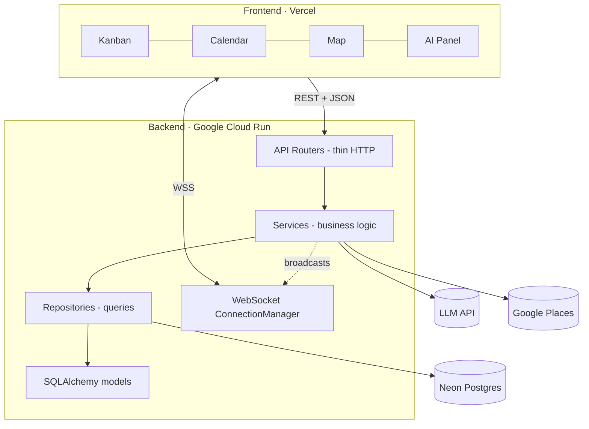

# TripScape

**Collaborative trip planning that feels live.**

Kanban, calendar, and map views of one trip — with WebSocket-driven realtime, AI itinerary streaming, and a strict 4-layer async backend.

> **Note on this repository.** This is the *public-facing* overview of TripScape, written for recruiters, interviewers, and portfolio reviewers. The full implementation lives in a separate private repository. Source code is available on request for evaluation.

---

## The problem

Planning a trip with other people usually means juggling three disconnected tools: a notes app for the to-do list, a calendar for the schedule, and a maps app for the places. Nothing stays in sync, and "collaboration" means screenshotting and pasting into a group chat.

## What TripScape does

TripScape models a trip as a single tree of **cards** (activities, sub-tasks, places) and renders that one source of truth through three synchronized lenses:

1. **One trip, three views.** A nested Kanban board, a per-day calendar grid, and a Leaflet map of every pinned place — the same cards, three perspectives.
2. **Genuinely real-time.** Move a card in one browser and it lands in another in well under a second, via a per-trip WebSocket fan-out wired into the *service* layer so every code path stays consistent.
3. **AI that fits the data model.** An LLM generates structured itineraries (guaranteed-shape output validated by Pydantic), streamed to the browser token-by-token; accepted items are geocoded so they appear on the map immediately.
4. **An engineering spine worth showing off.** Strict 4-layer async backend, recursive CTE subtree fetches, fractional indexing for ordering, optimistic mutations with rollback, soft delete, and an append-only audit log.

## Main features

| Area | What's implemented |
| --- | --- |
| **Multi-view planning** | Kanban (nested, drag-and-drop), per-day calendar grid, and an interactive map — all reading the same card tree. |
| **Realtime collaboration** | Per-trip WebSocket broadcasts for card/trip/member events; client auto-reconnects with backoff and suppresses self-echoes so optimistic UIs don't flicker. |
| **Role-aware access** | Trip membership with `owner / editor / viewer` roles; invite links with expiring tokens. |
| **Authentication** | JWT auth with refresh tokens, plus optional Google OAuth (additive — coexists with password login). |
| **AI itineraries** | Structured, streamed itinerary generation with graceful degradation when the feature is unconfigured. |
| **Audit log** | Every card mutation is recorded using the same event verbs the WebSocket broadcasts, so the two streams can't drift. |
| **Production hardening** | Rate limiting on auth + AI endpoints, request-id propagation, configurable CORS, and config that refuses to boot in production with dev defaults. |

## Tech stack

**Frontend** — React 19, TypeScript (strict), Vite, Tailwind CSS, TanStack Query (server state), Zustand (UI state), `@dnd-kit` (drag-and-drop), Leaflet / react-leaflet (maps).

**Backend** — Python 3.12, FastAPI, SQLAlchemy 2.0 (async, `asyncpg`), Pydantic v2, Alembic (migrations), Starlette WebSockets, authlib, slowapi.

**Data & infra** — PostgreSQL (Neon in production, Docker locally), backend on Google Cloud Run, frontend on Vercel. External services: an LLM API for itineraries and Google Places for geocoding (both optional and feature-flagged).

**Quality** — Ruff + mypy (backend), ESLint + Prettier + tsc (frontend), pytest against real Postgres, Vitest + Playwright (frontend), GitHub Actions CI, pre-commit hooks.

## High-level architecture

Each backend layer talks only to the one below it. Sessions are injected via dependency injection and commit on success / roll back on exception, so route handlers never manage transactions directly.

## Screenshots

> _Placeholders — add exported images to `assets/` and update these links._

| Kanban | Calendar | Map |
| --- | --- | --- |
|  |  |  |

## More documentation

- [`PROJECT_SUMMARY.md`](PROJECT_SUMMARY.md) — motivation, scope, design decisions, status, limitations.
- [`TECHNICAL_OVERVIEW.md`](TECHNICAL_OVERVIEW.md) — architecture, components, data flow, testing & deployment.
- [`CASE_STUDY.md`](CASE_STUDY.md) — problem → approach → result narrative.
- [`RESULTS_SUMMARY.md`](RESULTS_SUMMARY.md) — what was built and how it's verified.
- [`RECRUITER_NOTES.md`](RECRUITER_NOTES.md) — what this project demonstrates, by role.

---

Built by Sean Kim — Statistics & Computer Science undergraduate. Feedback welcome.

